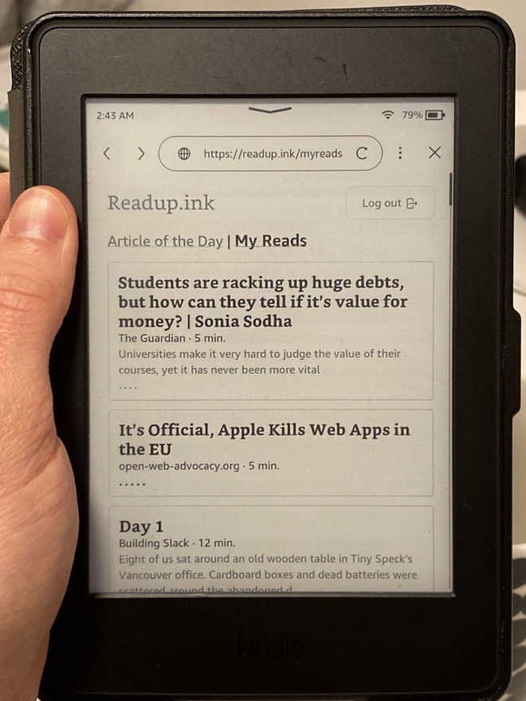
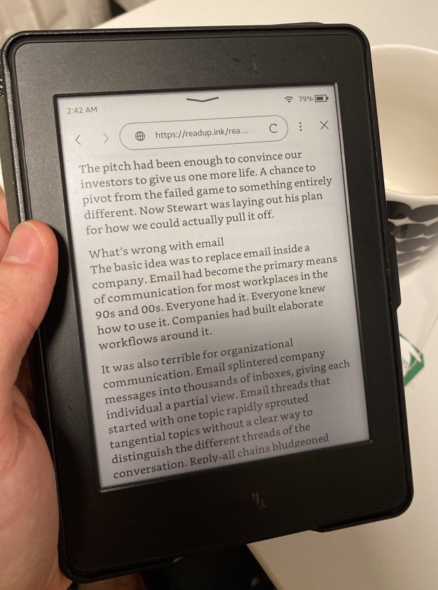

# Readup Ink - Readup for Kindle

A minimal readup.org frontend that I built for the browser of my Kindle
from 2015.

I’m really enjoying Readup on e-ink.

See it in action on https://readup.ink/, which is connected to the main
https://readup.org/ API.

Or, try it out on https://ink.koffiecouques.be/ - the first non-original Readup
instance.

**It’s not feature-complete, but most basics are there:**

- logging in with your Readup account
- seeing My Reads & your History
- the AOTD competition (no AOTD history yet)
- a working read tracker in many articles.

Incidentally, this is also a way to use Readup.org on Android via a browser.

If you're interested in contributing, or making this work on your e-reader, very
cool! Check [contributing](./CONTRIBUTING.md).

## What doesn't work yet

- Images. For some reason, the (double) parser removes images (see below). The
  Kindle is technically capable of displaying them though.
- Posting articles: this would be cool to add.
- Adding articles (on Kindle). I removed this from the Kindle, because you won't
  actually be typing in article URLs to add on your Kindle, will you? The
  expected flow is that you use Readup on other devices to add articles.
